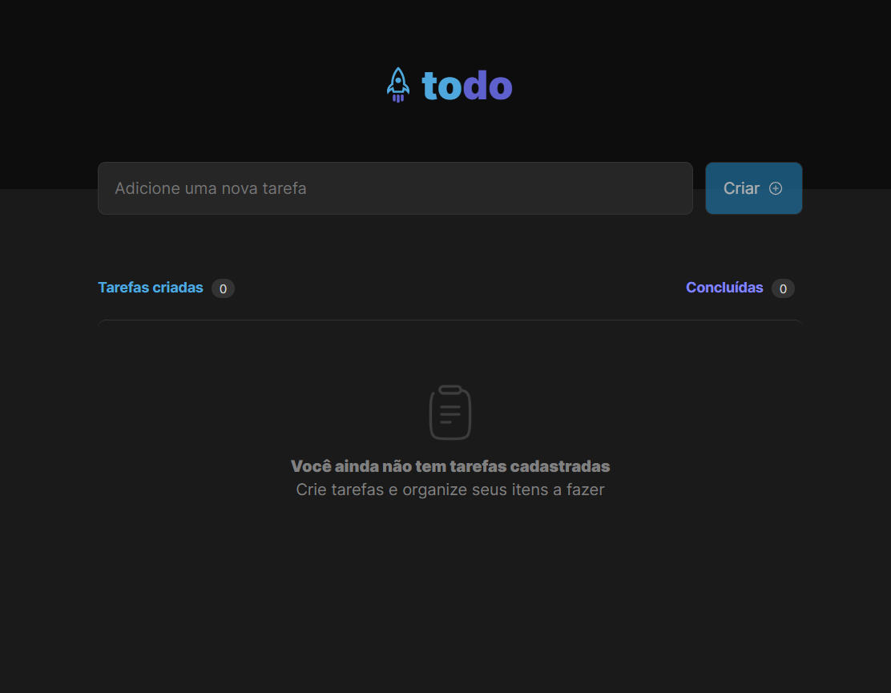
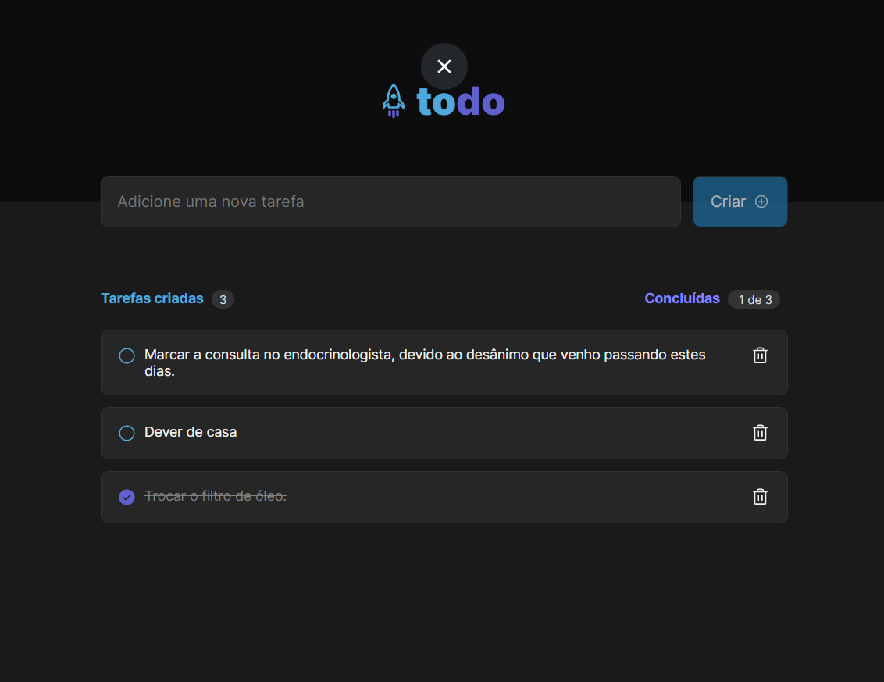

# Todo-List
 
## Sobre o projeto

https://todo-ignite-desafios01.netlify.app/

O ToDo-list é um projeto projeto desenvolvido como requisito avaliativo para o curso **Ignite Rocketseat**.

Neste foi proposto utilizando os fundamentos do ReactJs:
- Adicionar uma nova tarefa;
- Marcar e desmarcar uma tarefa concluída;
- Remover uma tarefa da listagem;
- Mostrar o progresso de conclusão das tarefas.

## Layout web





## Tecnologias utilizadas
- HTML / CSS / TypeScript
- ReactJS
- vite
- phosphor-icons/react
- uuid

## Funcionalidades
- Estados;
- Imutabilidade dos estado;
- Listas e chaves;
- Propriedades;
- Componentização.

# Como executar o projeto

Pré-requisitos: NODE e npm

```bash
# clonar repositório
git clone https://github.com/Paulohbarbosa/Todo-List.git

# entrar na pasta do projeto raiz e instale as dependências
npm install

# executar o projeto
npm rum dev
```

# Autor

Paulo Barbosa

https://www.linkedin.com/in/paulo-henrique-barbosa-495492160
